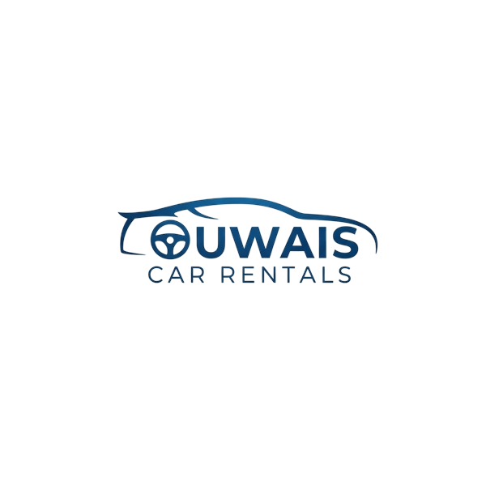

# FleetWise - Car Rental Management System

FleetWise is a comprehensive car rental management application built with **Laravel 11**, **Livewire 3**, and **Tailwind CSS**. It allows owners to manage their vehicle fleet, track rentals, schedule maintenance, and generate PDF contracts.



## Features

-   **Dashboard**: Overview of fleet status, active rentals, and maintenance alerts.
-   **Fleet Management**: Add, edit, and track cars (Make, Model, Year, License Plate, Daily Rate).
-   **Rental Management**:
    -   Create rentals with customer details.
    -   **Contract Generation**: Automatically generate and download PDF rental agreements.
    -   Track rental status (Active, Completed, Cancelled).
    -   Calculate total costs and track prepaid amounts.
-   **Maintenance Tracking**: Schedule and record maintenance services and costs.
-   **Settings**: Configure standard "Terms and Conditions" for rental contracts.
-   **Responsive Design**: Modern UI optimized for desktop and mobile.

## Tech Stack

-   **Backend**: Laravel 11.x
-   **Frontend**: Livewire 3.x, Tailwind CSS, Alpine.js
-   **Database**: SQLite (Default) or MySQL
-   **PDF Generation**: barryvdh/laravel-dompdf

## Installation

1.  **Clone the repository**
    ```bash
    git clone https://github.com/hayder218/rentals.git
    cd rentals
    ```

2.  **Install Dependencies**
    ```bash
    composer install
    npm install
    ```

3.  **Environment Setup**
    ```bash
    cp .env.example .env
    php artisan key:generate
    ```

4.  **Database Setup**
    Create the SQLite database and run migrations/seeders:
    ```bash
    touch database/database.sqlite
    php artisan migrate:fresh --seed
    ```
    *Note: The seeder creates 5 cars, 20 rentals, and 33 maintenance records with sample data.*

5.  **Build Assets**
    ```bash
    npm run build
    ```

6.  **Run Application**
    ```bash
    php artisan serve
    ```
    Visit `http://127.0.0.1:8000` in your browser.

## Configuration

-   **Contract Terms**: Navigate to `/settings` or click "Settings" in the sidebar to define your rental terms and conditions.
-   **Logo**: The application uses `public/logo.png` for branding. Replace this file to update the logo.

## License

This project is open-sourced software licensed under the [MIT license](https://opensource.org/licenses/MIT).
